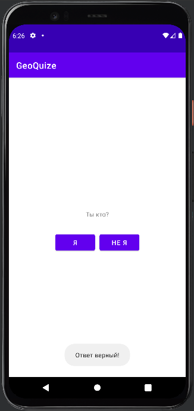
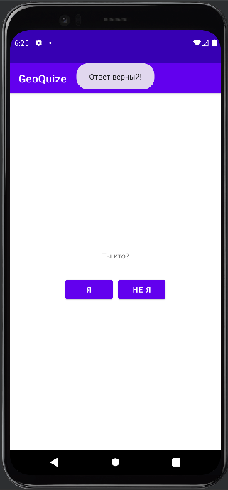

# <p align = "center">Работа с `Toast` в `Android Studio` на языке `Kotlin`</p>

# <p align = "center">Оглавление</p>

- [Цели и задачи](#задача)
- [Решение задач](#решение-задачи)
  - [Kotlin](#kotlin)
- [Вывод](#вывод)

***

# <p align = "center">Задача</p>

Изменить программный код так, чтобы уведомления появлялись сверху, а не снизу.
```kotlin
private lateinit var true_button:Button
private lateinit var false_button:Button

class MainActivity : AppCompatActivity() {
    override fun onCreate(savedInstanceState: Bundle?) {
        super.onCreate(savedInstanceState)
        setContentView(R.layout.activity_main)

        true_button = findViewById(R.id.true_button);
        false_button = findViewById(R.id.false_button);

        true_button.setOnClickListener(){
            Toast.makeText(this, R.string.currect_toast, Toast.LENGTH_SHORT).show();
        }

        false_button.setOnClickListener(){
            Toast.makeText(this, R.string.incurrect_toast, Toast.LENGTH_SHORT).show();
        }
    }
}
```

Результат работы кода до изменений:
<p align = "center">

</p>
***

# <p align = "center">Решение задачи</p>

## Kotlin

```kotlin
private lateinit var true_button:Button
private lateinit var false_button:Button
private lateinit var toast:Toast

class MainActivity : AppCompatActivity() {
    override fun onCreate(savedInstanceState: Bundle?) {
        super.onCreate(savedInstanceState)
        setContentView(R.layout.activity_main)

        true_button = findViewById(R.id.true_button);
        false_button = findViewById(R.id.false_button);

        true_button.setOnClickListener(){
            toast = Toast.makeText(this, R.string.currect_toast, Toast.LENGTH_SHORT);
            toast.setGravity(Gravity.TOP, 0, 0);
            toast.show();
        }

        false_button.setOnClickListener(){
            toast = Toast.makeText(this, R.string.incurrect_toast, Toast.LENGTH_SHORT);
            toast.setGravity(Gravity.TOP, 0, 0);
            toast.show()
        }
    }
}
```

Результат работы кода gjckt изменений:
<p align = "center">

</p>

# <p align = "center">Вывод</p>

Выполнил данную задачу, потренировался в овладении языка `Kotlin`.
